# Personal Prompts & Workflows

A collection of AI agent prompts and workflows to enhance your development productivity and coding experience.

## 🚀 Quick Start

1. **Clone the repository:**
   ```bash
   cd your-project-folder  
   git clone https://github.com/minhquan23102000/personal-prompts.git .local
   ```
   or you can fork this repo for personal use and storage.

2. **How it works:**
   - **Rules**: Add specific coding rules to your AI agent
   - **Workflows**: Enable command-based workflow execution
   - **Generator**: Create custom prompts and workflows

## 🎯 Why This Simple Solution Works Best

### Architecture Overview

```mermaid
graph TB
    A[Developer] --> B[AI Agent]
    B --> C{Command Type}
    
    C -->|Rules| D[📋 Coding Standards]
    C -->|Workflows| E[⚡ Task Automation]
    C -->|Generator| F[🛠️ Custom Creation]
    
    D --> G[Consistent Code Quality]
    E --> H[Faster Development]
    F --> I[Personalized Workflows]
    
    G --> J[🚀 Productivity Boost]
    H --> J
    I --> J

```



### Key Benefits

#### 🎯 **Simplicity First**
- **No complex setup**: Just clone and use
- **Plain text files**: Easy to read, edit, and version control
- **Universal compatibility**: Works with any AI agent (Claude, GPT, etc.)
- **No dependencies**: Pure markdown, no installation required

#### ⚡ **Immediate Value**
- **Zero learning curve**: Copy-paste approach
- **Instant results**: Start using rules and workflows immediately
- **Incremental adoption**: Add features as needed
- **No vendor lock-in**: Your prompts, your control

#### 🔄 **Flexibility & Customization**
- **Modular design**: Mix and match rules and workflows
- **Easy modification**: Edit files directly to suit your needs
- **Version control friendly**: Track changes and improvements
- **Shareable**: Easy to share with team members


### How It Solves Common Problems


## 🛠️ Setup Instructions

### Using Rules

Add rules to your AI agent's system prompt (Claude, Cursor, or other AI tools):

1. Copy the content from any rule file in the `rules/` directory
2. Paste it into your AI agent's system prompt
3. The agent will now follow those coding standards

### Using Workflows

Enable command-based workflow execution:

1. Add this to your AI agent's system prompt:
   ```
   When I type "COMMAND: {command-file}.md", you must read and follow the command inside the file for execution.
   ```

2. Execute workflows by typing:
   ```
   COMMAND: .local/workflows/{command-file}.md
   
   {Additional Context}
   ```

### Generating Custom Prompts

Create your own prompts and workflows:

1. Visit [Google AI Studio](https://aistudio.google.com/app/prompts/new_chat)
2. Use one of these system prompts:
   - `rules-workflow-generator.md` - Basic generator
   - `v2_rules-workflow-generator.md` - Enhanced generator
3. Input your requirements and generate custom prompts or workflows


## 🔧 Technical Advantages

### File-Based Architecture
```
📁 .local/
├── 📋 rules/          # Coding standards
├── ⚡ workflows/       # Task automation
└── 🛠️ generators/     # Custom creation
```

**Benefits:**
- **Version Control**: Track changes with Git
- **Backup**: Easy to backup and restore
- **Sharing**: Simple file sharing
- **Portability**: Works across devices

### Universal Compatibility
- **Any AI Agent**: Claude Code, GPT, Cursor, Wrap, etc.


## 🚀 Getting Started Examples

### Example 1: Add Python Coding Standards
```bash
# Copy the Python coding rules
cat .local/rules/python-coding.md
# Paste into your AI agent's system prompt
```

### Example 2: Execute a Workflow
```
COMMAND: .local/workflows/create-prd.md

Create a PRD for a task management app with user authentication
```

### Example 3: Generate Custom Workflow
1. Use the generator prompt
2. Request: "Create a workflow for code review automation"
3. Get your custom workflow file

---

**Happy coding! 🎉**


