# Personal Prompts & Workflows

A collection of AI agent prompts and workflows to enhance your development productivity and coding experience, now featuring a **Rules Combiner CLI** for easy rule management.

## 🚀 Quick Start

1. **Clone the repository:**
   ```bash
   cd your-project-folder  
   git clone https://github.com/minhquan23102000/personal-prompts.git .local
   ```
   or you can fork this repo for personal use and storage.

2. **Install dependencies (for CLI usage):**
   ```bash
   # Using uv (recommended)
   uv sync --dev
   
   # Or using pip
   pip install -e .
   ```

3. **How it works:**
   - **Rules**: Add specific coding rules to your AI agent
   - **Workflows**: Enable command-based workflow execution
   - **Generator**: Create custom prompts and workflows
   - **CLI Tool**: Combine multiple rules into a single AGENT.md file

## 🎯 Why This Simple Solution Works Best

### Architecture Overview

```mermaid
graph TB
    A[Developer] --> B[AI Agent]
    B --> C{Command Type}
    
    C -->|Rules| D[📋 Coding Standards]
    C -->|Workflows| E[⚡ Task Automation]
    C -->|Generator| F[🛠️ Custom Creation]
    
    D --> G[Consistent Code Quality]
    E --> H[Faster Development]
    F --> I[Personalized Workflows]
    
    G --> J[🚀 Productivity Boost]
    H --> J
    I --> J

```



### Key Benefits

#### 🎯 **Simplicity First**
- **No complex setup**: Just clone and use
- **Plain text files**: Easy to read, edit, and version control
- **Universal compatibility**: Works with any AI agent (Claude, GPT, etc.)
- **No dependencies**: Pure markdown, no installation required

#### ⚡ **Immediate Value**
- **Zero learning curve**: Copy-paste approach
- **Instant results**: Start using rules and workflows immediately
- **Incremental adoption**: Add features as needed
- **Token cost planning**: Built-in estimation for AI model usage costs
- **No vendor lock-in**: Your prompts, your control

#### 🔄 **Flexibility & Customization**
- **Modular design**: Mix and match rules and workflows
- **Easy modification**: Edit files directly to suit your needs
- **Version control friendly**: Track changes and improvements
- **Shareable**: Easy to share with team members


### How It Solves Common Problems


## 🛠️ Setup Instructions

### Using the Rules Combiner CLI 🚀

The Rules Combiner CLI is a powerful tool that helps you select and combine multiple rule files into a single, well-formatted AGENT.md file.

#### Installation

```bash
# Install dependencies
uv sync --dev

# Or with pip
pip install -e .
```

#### Usage

**List all available rules:**
```bash
# Using uv (recommended)
uv run python -m rules_combiner.cli list-rules

# Using wrapper script (no installation needed)
./rules-combiner list-rules        # Linux/Mac
rules-combiner.bat list-rules       # Windows

# Or if installed with pip
rules-combiner list-rules
```

**Generate combined AGENT.md file interactively:**
```bash
# Using uv (recommended)
uv run python -m rules_combiner.cli generate

# Using wrapper script (no installation needed)
./rules-combiner generate           # Linux/Mac
rules-combiner.bat generate         # Windows

# Or if installed with pip
rules-combiner generate
```

#### CLI Options

**Generate command options:**
- `--rules-dir PATH`: Directory containing rule files (default: rules)
- `--output PATH`: Output file name (default: AGENT.md)
- `--no-backup`: Skip backing up existing output file
- `--no-toc`: Skip generating table of contents

#### Token Estimation

The CLI provides **estimated token counts** to help you plan for AI model usage costs:
- **Estimation Method**: Approximately 4 characters = 1 token
- **Display**: Shows tokens for each rule file and total tokens for your selection
- **Use Case**: Helps you stay within model context limits and estimate API costs
- **Accuracy**: Estimates are approximate - actual tokens may vary based on the specific model's tokenizer

**Example with custom options:**
```bash
uv run python -m rules_combiner.cli generate --rules-dir custom_rules --output MY_AGENT.md --no-backup
```

#### Interactive Selection

When you run the `generate` command, you'll see:

1. **Rule Discovery**: Automatically finds all `.md` files in your rules directory
2. **Interactive Selection**: Choose rules using various formats:
   - Individual numbers: `1,3,5`
   - Ranges: `1-3` or `2-5`
   - Mixed: `1,3-5,7`
   - All rules: `all`
3. **Preview & Confirm**: Review your selection before generating
4. **Output Generation**: Creates a professional AGENT.md with:
   - Table of contents with anchor links
   - Properly formatted sections
   - Preserved markdown structure
   - Automatic backup of existing files
   - Token estimation (~4 characters = 1 token) for cost planning

#### Example CLI Session

```bash
$ uv run python -m rules_combiner.cli generate

Discovering rule files in: rules
Found 9 rule files

Select rules to combine:
┏━━━━━━━━━━━━━━━━━━━━━━━━━━━━━━━┳━━━━━━━━━━━━━━━━━━━━━━━━━━━━━━━━━━━━━━━━━━━┳━━━━━━━━━━━━━┳━━━━━━━━━┓
┃ No. ┃ Filename                      ┃ Title                                     ┃        Size ┃  Tokens ┃
┡━━━━━╇━━━━━━━━━━━━━━━━━━━━━━━━━━━━━━━╇━━━━━━━━━━━━━━━━━━━━━━━━━━━━━━━━━━━━━━━━━━━╇━━━━━━━━━━━━━╇━━━━━━━━━┩
│  1  │ python-coding.md              │ Mental Model: The Modern Python Craftsman │ 2,940 bytes │    ~735 │
│  2  │ problem-solver.md             │ Mental Model: The Expert Problem Solver   │ 4,704 bytes │  ~1,176 │
│  3  │ production-code.md            │ Mental Model: The Deliberate Coder        │ 4,734 bytes │  ~1,183 │
└─────┴───────────────────────────────┴───────────────────────────────────────────┴─────────────┴─────────┘

Selection options:
• Individual numbers: 1,3,5
• Ranges: 1-3 or 2-5
• Mixed: 1,3-5,7
• All: all

Select rule files (e.g., 1,3-5 or 'all'): 1-3

Selected 3 rule files:
  • python-coding.md (~735 tokens)
  • problem-solver.md (~1,176 tokens)
  • production-code.md (~1,183 tokens)

Total: 12,378 bytes, ~3,094 estimated tokens

Proceed with this selection? (y/n): y

Processing 3 selected rules...
Processing: python-coding.md
Processing: problem-solver.md
Processing: production-code.md

Writing combined rules to: AGENT.md
✅ Successfully generated AGENT.md (11,714 bytes)
Combined 3 rules into 11,714 bytes
```

### Using Rules Manually

Add rules to your AI agent's system prompt (Claude, Cursor, or other AI tools):

1. Copy the content from any rule file in the `rules/` directory
2. Paste it into your AI agent's system prompt
3. The agent will now follow those coding standards

### Using Workflows

Enable command-based workflow execution:

1. Add this to your AI agent's system prompt:
   ```
   Command File Trigger: If user input matches the exact format COMMAND: {filename}.md, then the agent must immediately prioritize reading the contents of the specified markdown file as its next set of instructions.
   Sequential Execution: The agent must process and execute the commands found within the specified file in the order they are presented, from top to bottom. Did not stop until you have the bottom result, or encountering any error need human help.
   ```

2. Execute workflows by typing:
   ```
   COMMAND: .local/workflows/{command-file}.md
   
   {Additional Context}
   ```

### Generating Custom Prompts

Create your own prompts and workflows:

1. Visit [Google AI Studio](https://aistudio.google.com/app/prompts/new_chat)
2. Use one of these system prompts:
   - `rules-workflow-generator.md` - Basic generator
   - `v2_rules-workflow-generator.md` - Enhanced generator
3. Input your requirements and generate custom prompts or workflows


## 🔧 Technical Advantages

### File-Based Architecture
```
📁 .local/
├── 📋 rules/          # Coding standards
├── ⚡ workflows/       # Task automation
└── 🛠️ generators/     # Custom creation
```

**Benefits:**
- **Version Control**: Track changes with Git
- **Backup**: Easy to backup and restore
- **Sharing**: Simple file sharing
- **Portability**: Works across devices

### Universal Compatibility
- **Any AI Agent**: Claude Code, GPT, Cursor, Wrap, etc.


## 🚀 Getting Started Examples

### Example 1: Add Python Coding Standards
```bash
# Copy the Python coding rules
cat .local/rules/python-coding.md
# Paste into your AI agent's system prompt
```

### Example 2: Execute a Workflow
```
COMMAND: .local/workflows/create-prd.md

Create a PRD for a task management app with user authentication
```

### Example 3: Generate Custom Workflow
1. Use the generator prompt
2. Request: "Create a workflow for code review automation"
3. Get your custom workflow file

---

**Happy coding! 🎉**


